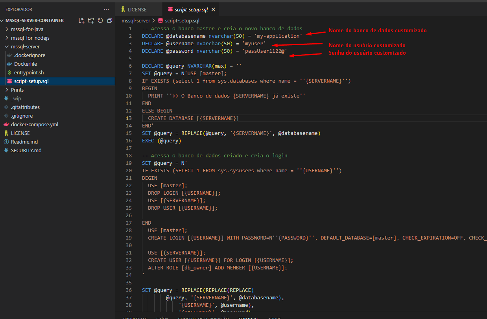
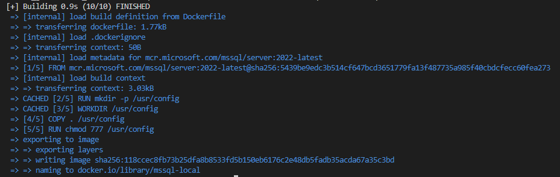
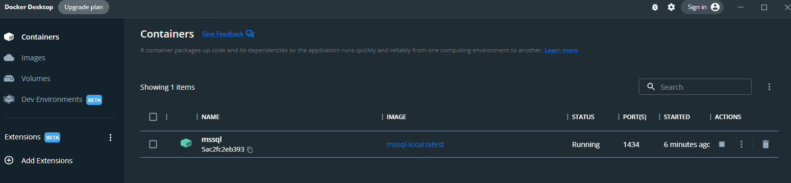
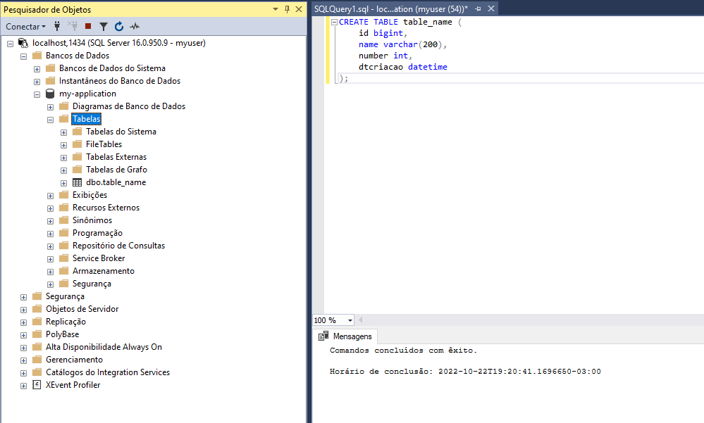
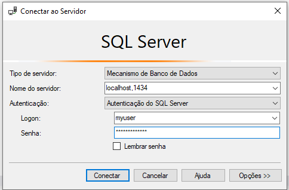

# <div> Microsoft SQL Server - Containered </div>

Link Oficial: https://www.microsoft.com/pt-br/sql-server/
Este projeto tem de a oferecer métodos diferentes e simples para criar instancias Microsoft SQL Server em container para auxiliar desenvolvedores e testes.

Learning Free: https://www.microsoft.com/pt-br/sql-server/sql-server-2022

> Não é recomendado a utilização destes em ambientes de Produção.

*Requisitos técnicos:
  - Docker Desktop
  - Microsoft SQL Server Management Studio (ou outra IDE de Banco de dados de sua preferência).

Windows:
| Software  | Download |
| ---       | ---      |
| Docker-Desktop | [download](https://desktop.docker.com/win/main/amd64/Docker%20Desktop%20Installer.exe?utm_source=docker&utm_medium=webreferral&utm_campaign=dd-smartbutton&utm_location=header) |
| MSSQL Studio | [download](https://learn.microsoft.com/pt-br/sql/ssms/download-sql-server-management-studio-ssms) |

<hr/>


## <u>01. Docker command </u>

Acesse a pasta raiz com o terminal powershell.

Conteúdo da pasta `./mssql-server`:
```
|-- mssql-server
|   |-- .dockerignore
|   |-- docker-compose.yml
|   |-- Dockerfile
|   |-- entrypoint.sh
|   |-- script-setup.sql
```

No arquivos `script-setup.sql`, é onde estão as regras de criação de um banco de dados para sua aplicação, assim como um usuário e senha. Essas informações estão parametrizadas no topo do conteúdo do arquivo para facilitar a devida alteração, conforme print abaixo.
> Fique livre para customizações do script conforme sua necessidade.

[](./Prints/02-DockerFile-DBCustom.png)


Para compilar a imagem, inicie o Docker-Desktop e em seguida execute o comando:

```
docker build -t mssql-local ./mssql-server
```
Terá uma saída aproximadamente como esta:
[](./Prints/03-BuildDockerImage.png)


Para execução da imagem, expondo a porta e montando um volume persistente (para que não perca o banco de dados assim como as configurações), execute:

```powershell
docker run -d -p 1434:1433 `
  -v="$pwd\_volume\data":/var/opt/mssql/data `
  -v="$pwd\_volume\log":/var/opt/mssql/log `
  -v="$pwd\_volume\secrets":/var/opt/mssql/secrets `
  --name mssql `
  --hostname mssql `
  mssql-local:latest
```
> Nota: Veja que na porta, exponho a 1434 (número aleatório) apenas pois tenho uma instancia fisica do SQL Server instalado em minha máquina, logo, se eu colocar a porta default 1433, terá conflito e ocorrerá falha no start do container.
[](./Prints/04-DockerRun.png)


Após finalizar o dia de desenvolvimento, vc poderá normalmente stopar o container e inicia-lo no dia seguinte para continuar os trabalhos e não perderá os dados.

```powershell
# Para Stopar o container
docker stop mssql

# Para Iniciar o container
docker start mssql
```
[](./Prints/05-SQLExemple.png)



<hr/>

## <u>02. Docker Compose </u>

Acesse a pasta raiz com o terminal powershell.

O arquivo `./mssql-server/docker-compose.yml` contém a estrutura que irá buildar e montar os diretórios persistentes.

### __CRIAÇÃO__
Para criar a infraestrutura, execute o comando: 

```
docker-compose -f .\mssql-server\docker-compose.yml up --build -d
```

Conecte na instância utilizando os dados configurados com a senha SA ou a de usuário customzado (presente no arquivo script-setup.sql)

Exemplo:

[](./Prints/06-LoginMSSQL.png)


### __STOP__
Para "stopar" a instancia, para que possa desligar e preservar a infraestrutura, execute o comando:
```
docker-compose -f .\mssql-server\docker-compose.yml stop
```

### __START__
Para "startar" a instancia novamente e dar continuidade na utilização, execute o comando:
```
docker-compose -f .\mssql-server\docker-compose.yml stop
```

### __REMOVE__
Para deletar a infraestrutura criada. execute o comando:
```
docker-compose -f .\mssql-server\docker-compose.yml down
```
> NOTA: O comando `docker-compose down`, não faz a remoção do volume montado. Neste exemplo, o volume aparecerá na pasta raiz do repositório com o nome `_volume`. Remova manualmente caso não queira preservar os dados.